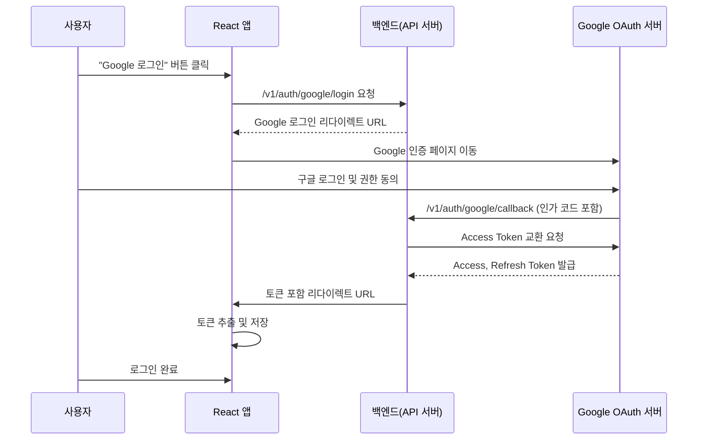

# OAuth 2.0
## 1. 정의 및 주요 역할

**OAuth 2.0**은 사용자의 **권한 부여(Authorization)**를 안전하게 위임하기 위한 표준 프레임워크이다. 즉, 사용자가 직접 비밀번호를 제3의 서비스에 제공하지 않고도 자신의 자원에 접근할 수 있도록 허용하는 방식이다. 중요한 점은 OAuth 2.0의 목적이 **인증(Authentication)**이 아니라 **권한 위임**이라는 것이다.

이 구조는 네 가지 주요 구성 요소로 이루어진다.

* **Resource Owner (사용자)**: 자신의 자원을 소유하고 있으며, 접근 권한을 부여할 수 있는 주체이다.
* **Client (데이터를 얻고자 하는 서비스)**: 사용자의 자원에 접근하려는 제3의 애플리케이션이다.
* **Authorization Server (권한 서버)**: 사용자의 동의를 확인한 후, 클라이언트에게 토큰을 발급하는 역할을 한다.
* **Resource Server (리소스 서버)**: 발급된 토큰을 검증하고 실제 데이터(API)를 제공하는 서버이다.

이러한 구조를 통해 OAuth 2.0은 사용자 자격 증명(아이디, 비밀번호)을 노출하지 않고도 외부 서비스 간 안전한 데이터 접근을 가능하게 한다.

---

## 2. 전형적 인증/권한 부여 플로우 (Authorization Code + PKCE)

Authorization Code 방식은 OAuth 2.0의 대표적인 플로우로, 웹 애플리케이션에서 주로 사용된다. 특히 보안을 강화하기 위해 **PKCE(Proof Key for Code Exchange)**와 함께 사용된다.

1. **클라이언트가 사용자에게 권한 요청**을 보낸다. 사용자는 로그인 및 접근 권한을 허용할지 여부를 선택한다.
2. 사용자가 동의하면 **권한 서버는 인가 코드(Authorization Code)**를 클라이언트에 전달한다.
3. 클라이언트는 이 인가 코드와 함께 **code_verifier**를 백엔드 서버로 전달하여 토큰 교환을 요청한다.
4. 백엔드 서버는 권한 서버로 요청을 보내 **Access Token**과 **Refresh Token**을 발급받는다.
5. 이후 **Access Token**을 사용해 리소스 서버에 접근하여 필요한 데이터를 요청한다.

이 방식은 클라이언트가 직접 Access Token을 받지 않고 백엔드를 통해 교환하기 때문에, 토큰 노출 위험을 줄일 수 있다.

---

## 3. PKCE(Proof Key for Code Exchange)

PKCE는 인가 코드 탈취 공격을 방지하기 위한 보안 확장 기능이다.
클라이언트 애플리케이션이 외부 환경(예: 브라우저, 모바일 앱)에 노출될 수 있을 때 사용된다.

작동 방식은 다음과 같다.

1. 클라이언트는 우선 랜덤한 문자열인 **code_verifier**를 생성한다.
2. 이를 해시(SHA256)한 값인 **code_challenge**를 만들어 권한 요청 시 함께 전송한다.
3. 토큰을 교환할 때 클라이언트는 원래의 **code_verifier**를 전달하고, 서버는 이를 해시하여 기존의 **code_challenge**와 비교해 일치 여부를 확인한다.

이 과정을 통해, 인가 코드가 탈취되더라도 원본 **code_verifier**가 없으면 토큰을 발급받을 수 없어 보안이 강화된다.

---

## 4. OpenID Connect(OIDC)와의 차이

OAuth 2.0과 OIDC(OpenID Connect)는 종종 함께 사용되지만, 목적이 다르다.

* **OAuth 2.0**은 **권한 위임(Authorization)**에 초점을 두고 있다. 즉, 사용자의 데이터에 접근할 수 있도록 허가하는 데 목적이 있다.
* **OIDC(OpenID Connect)**는 OAuth 2.0을 기반으로 하며, 여기에 **사용자 인증(Authentication)** 기능이 추가된 확장 프로토콜이다. 사용자의 프로필, 이메일, ID 정보를 포함한 **ID Token**을 반환할 수 있다.

정리하자면 OAuth 2.0은 “누가 데이터에 접근할 수 있는가”를 결정하고, OIDC는 “사용자가 누구인가”를 확인한다.

---

## 5. 장점과 단점

**장점**

* 서로 다른 서비스나 플랫폼 간에 권한을 안전하게 위임할 수 있는 표준화된 구조이다.
* 사용자 자격 증명(비밀번호 등)을 직접 노출하지 않아 보안성이 높다.
* 서버와 클라이언트 간의 역할이 명확히 분리되어, 확장성과 재사용성이 높다.

**단점**

* 토큰 관리, 상태 유지, 리다이렉트 설정 등 구현 과정이 복잡하다.
* 설정 오류(URI, Redirect 경로 등)가 발생하면 보안 취약점으로 이어질 수 있다.
* 토큰 탈취나 유효 기간 관리 실패 시 보안 사고가 발생할 수 있다.

---

## 6. 예시: Google 소셜 로그인

이 흐름에서 사용자는 React 클라이언트에서 “Google 로그인” 버튼을 클릭하고, 인증 과정을 거친 후 최종적으로 백엔드가 토큰을 받아 클라이언트에 전달한다. 클라이언트는 이 토큰을 저장하여 로그인 상태를 유지한다.

---

## 7. Token Refresh 플로우

1. 사용자가 로그인할 때, **Access Token**과 **Refresh Token**이 함께 발급된다.
2. Access Token은 유효 기간이 짧기 때문에 만료되면 사용할 수 없다.
3. 이때 클라이언트는 **Refresh Token**을 이용해 백엔드에 새로운 Access Token을 요청한다.
4. 백엔드는 검증 후 새로운 Access Token을 발급하여 클라이언트에 전달한다.
5. 만약 Refresh Token도 만료되었거나 유효하지 않다면, 사용자는 다시 로그인해야 한다.

Access Token은 짧은 수명을 가져 보안을 유지하고, Refresh Token은 장기적으로 접근을 지속할 수 있도록 하는 역할을 한다.

---

# CORS (Cross-Origin Resource Sharing)

## 1. 개념

CORS는 **동일 출처 정책(Same-Origin Policy, SOP)**의 제약을 완화하기 위한 웹 표준이다.
기본적으로 브라우저는 보안을 위해 서로 다른 출처(프로토콜, 도메인, 포트)의 요청을 차단한다.
CORS는 이러한 제한을 완화하여 프론트엔드와 백엔드가 서로 다른 출처에 있더라도 안전하게 통신할 수 있도록 허용한다.

---

## 2. 요청 방식

| 종류                    | 조건                                                                                                                           |
| --------------------- | ---------------------------------------------------------------------------------------------------------------------------- |
| **Simple Request**    | 요청 메서드가 GET, POST, HEAD 중 하나이고, Content-Type이 단순 형식일 경우 (예: text/plain, application/x-www-form-urlencoded) 사전 요청 없이 바로 전송된다. |
| **Preflight Request** | PUT, DELETE 등 단순하지 않은 요청이나 커스텀 헤더를 포함하는 요청의 경우, 브라우저가 먼저 OPTIONS 요청을 보내 허용 여부를 확인한 뒤 실제 요청을 보낸다.                             |

---

## 3. 주요 CORS 헤더

| 헤더                                   | 기능                                                                 |
| ------------------------------------ | ------------------------------------------------------------------ |
| **Access-Control-Allow-Origin**      | 허용할 출처를 명시한다. 예: `http://localhost:3000`                           |
| **Access-Control-Allow-Methods**     | 허용되는 HTTP 메서드를 지정한다. 예: GET, POST, PUT, DELETE                     |
| **Access-Control-Allow-Headers**     | 요청 시 허용할 헤더를 지정한다. 예: Content-Type, Authorization                  |
| **Access-Control-Allow-Credentials** | 쿠키나 인증 정보가 포함된 요청을 허용할지 여부를 결정한다. true로 설정 시, Origin을 반드시 명시해야 한다. |

---

# RBAC vs ABAC

## 1. RBAC (Role-Based Access Control)

RBAC은 **역할(Role)**을 기반으로 권한을 부여하는 접근 제어 방식이다.
권한을 역할 단위로 묶어 관리하고, 사용자는 하나 이상의 역할을 부여받아 그에 따른 권한을 자동으로 가진다.

| 용어  | 설명                   | 예시           |
| --- | -------------------- | ------------ |
| 사용자 | 시스템 내에서 서비스를 이용하는 주체 | 김철수(사원)      |
| 역할  | 직무나 기능에 따라 묶인 권한 집합  | 재무팀 관리자, 회원  |
| 권한  | 실제로 수행할 수 있는 작업      | 결제 승인, 파일 관리 |

**장점**

* 구조가 단순하고 관리가 쉽다.
* 역할 단위로 권한을 관리하므로 재사용성과 확장성이 높다.

**단점**

* 시간, 위치, 소유자 등 동적인 조건을 표현하기 어렵다.
* 예외적인 접근 제어가 많아질수록 역할의 수가 지나치게 늘어나 관리가 복잡해질 수 있다.

---

## 2. ABAC (Attribute-Based Access Control)

ABAC은 **속성(Attribute)**과 **정책(Policy)**을 기반으로 접근을 제어하는 방식이다.
RBAC과 달리 사용자, 자원, 작업, 환경 등의 다양한 조건을 조합해 더 세밀하고 동적인 권한 관리를 할 수 있다.

| 속성유형            | 예시                         |
| --------------- | -------------------------- |
| 주체(Subject)     | 부서: 마케팅, 직위: 팀장, 등급: 1     |
| 객체(Object)      | 파일의 민감도, 저장 위치(US-East 서버) |
| 작업(Action)      | 읽기, 쓰기, 다운로드               |
| 환경(Environment) | 근무 시간, 내부망 접속 여부, 장비 유형    |

**장점**

* 다양한 속성과 조건을 조합해 유연한 정책을 만들 수 있다.
* 조건이 바뀔 때 실시간으로 권한을 재평가할 수 있다.

**단점**

* 정책이 많아질수록 설계와 관리가 복잡해진다.
* 초기 설정 시 고려해야 할 속성이 많아 유지보수 비용이 증가할 수 있다.

---

## 3. 한눈에 비교 표

| 구분       | RBAC (역할 기반)      | ABAC (속성 기반)               |
| -------- | ----------------- | -------------------------- |
| 핵심 요소    | 역할(Role)          | 속성(Attribute) + 정책(Policy) |
| 권한 결정 방식 | 사용자가 속한 역할에 따라 결정 | 여러 속성과 조건을 종합적으로 평가        |
| 유연성      | 낮음                | 매우 높음                      |
| 복잡성      | 단순하고 관리가 쉬움       | 정책이 복잡하고 관리가 어려움           |
| 적용 환경    | 내부 시스템, 정적 권한     | 클라우드, 외부 서비스, 동적 권한        |
